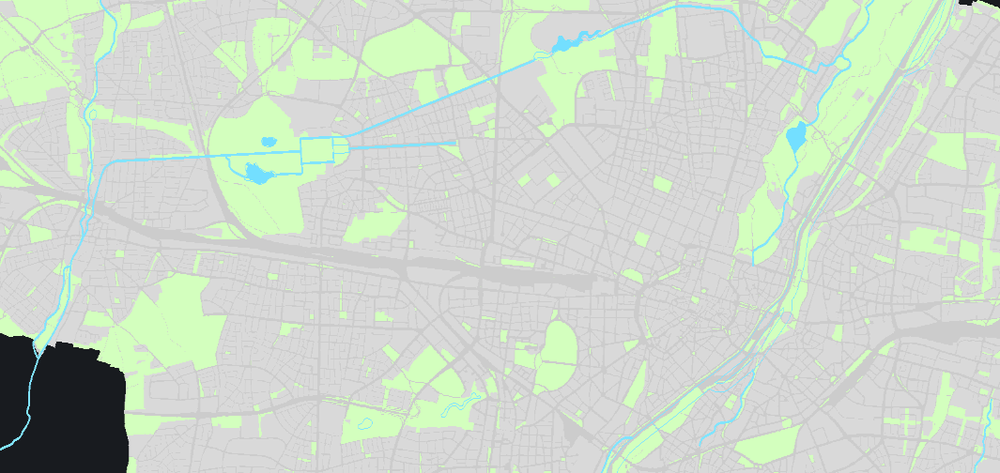
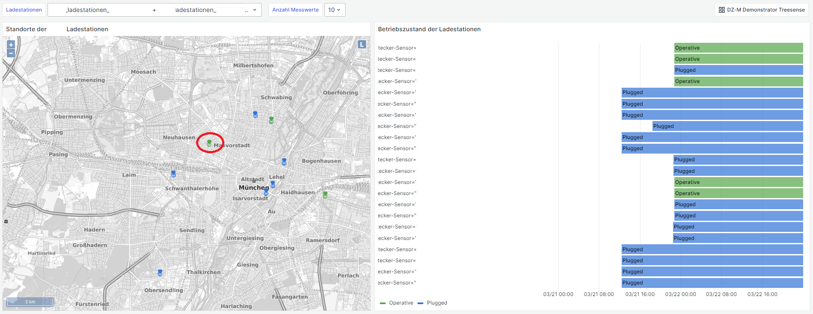
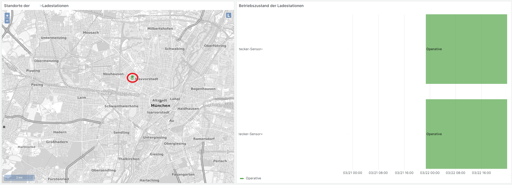

  

# Geomap WMS Panel Plugin
This plugin evolved from the [Orchestra Cities Map Panel-Plugins](https://github.com/orchestracities/map-panel). It extends original version by the functionality of the intergration of an [OGC Web Map Service](https://www.ogc.org/standard/wms/) (**WMS version 1.3.0**) as a base map layer. Additionally the plugin ships with an interactive filter tool to query the data by spatial conditions.

## Features
* Integration of OGC WMS 1.3.0 as base map layer
* Interactive spatial filter

## Using the Geomap WMS Panel Plugin
> ⚠️ Currently only WMS of version 1.3.0 is supported ⚠️
1. In the selection _Base layer_ choose the type _OGC Web Map Sevice_
2. In the text field _URL_ type in the base url of the WMS endpoint (NOTE: Only the URL of the service endpoint **WITHOUT** request parameters, z.B. https://geoportal.muenchen.de/geoserver/gsm/wms)
3. Successively choose layers from the drop down list


### Example 1): Basemap with three layers
Layer names:
- g_stadtkarte_gesamt_gtay
- g_stadtspaziergang_moosach_route_a
- baustellen_2_weeks


### Example 2): Basemap with three layers (layer names have whitespaces)
Layer names:
- Blöcke
- Linie_u_Stadtplanü. bis 150k
- stehende Gewässer generalisiert



## Using the spatial filter tool
An additional feature of the Geomap WMS Plugin is the spatial filter tool that allows drawing a polygon on the map panel to be used as filter for a data query. The polygon is representated as [Well-known-text (WKT)](https://en.wikipedia.org/wiki/Well-known_text_representation_of_geometry) and stored in a dashboard variable "geomap_wms_spatial_filter_geometry".

> ⚠️ It is mandatory to name the dashbaord variable "geomap_wms_spatial_filter_geometry" ⚠️

> ⚠️ 
The spatial filter tool uses the geographic coordinate system _urn:ogc:def:crs:OGC::CRS84_. The axis order is _longitude, latitude_. Openlayers (dependency of the geomap plugin) uses the CRS _CSR:84_ as alias for _EPSG:4326_ ([Quelle](https://openlayers.org/en/latest/apidoc/module-ol_proj_Projection-Projection.html)), even if the official axis order of _EPSG:4326_ would be _latitude_, _longitude_. This is because the  [Proj4Js-Library](https://github.com/proj4js/proj4js?tab=readme-ov-file#axis-order) uses the order `[x=longitude,y=latitude]` by default.
⚠️

To enable the spatial filter tool follow the steps below:

1. Create a [dashboard variable](https://grafana.com/docs/grafana/latest/dashboards/variables/add-template-variables/) of type "Constant" and the name "geomap_wms_spatial_filter_geometry" (**using a different name will result in the spatial filter tool to not work**). As initial value use e.g. `POLYGON((-180 -90,180 -90,180 90,-180 90,-180 -90))`, to selec all, if no polygon is drawn.


2. Use the dashboard variable in a datasource query, e.g. the SensorThings API, which allows the filtering by providing a WKT in the geometry function:

`/Things?$expand=Locations&$filter=substringof(name,'${tree_sensor:csv}') and st_intersects(Locations/location, geography'${geomap_wms_spatial_filter_geometry}')`


3. Enable the tool in the panel editor, press save or apply and leave edit mode


4. Activate the tool in the panel


5. Draw a polygon as spatial filter geometry. To apply the geometry set the last point on the starting point. After that the panels and datasources which use the variable "geomap_wms_spatial_filter_geometry" are updated automatically. To delete the geometry click on the cross symbol.


## Using data links
The Geomap WMS Panel Plugin allows the use of [dataLinks](https://grafana.com/docs/grafana/latest/panels-visualizations/configure-data-links/) to update a dashboard variable with data of the clicked feature. This enables interactions between the map panel and other panels in the dashbaord, which use the same dashboard variable in their data queries.
To make use of this functionality a datalink has to be created (see the [official documentation](https://grafana.com/docs/grafana/latest/panels-visualizations/configure-data-links/#add-a-data-link)) on how to do that.

> ⚠️ As of now the plugin is only able to handle on (the first) data link ⚠️

This example demonstrates how to configure the Geomap WMS Panel Plugin to update a dashboard variable "ladestationen" with the value of the data field of name "name" by clicking on a feature on the map.


Clicking on a certain feature on the map results in both, updating the map as well as all the panels which use the dashboard variable "ladestationen" in their queries.

Before:


After:


# Development
## Status of the original repository
This repository refers to the following version of its original: https://github.com/orchestracities/map-panel/tree/c0d3a19ce910b9c3ab8416f5a609afb10ff8c0fe

## Technical setup
- Grafana >= 10.0.2 as Docker container with [bind mounts to host filesystem](https://grafana.com/docs/grafana/latest/setup-grafana/installation/docker/#use-bind-mounts) mounting following conatiner directory _/var/lib/grafana/plugins_
- node v20.3.1
- npm 10.5.0
- Linux-based OS Windows with WSL
<!-- - Docker (Desktop) -->
<!-- - Minikube
- Helm -->

## Building the plugin
1. Clone the repository
```bash
git clone https://git.muenchen.de/geodatenservicemuenchen/grafana.git
```
2. Navigate in the directory _geomap-wms-panel_
```bash
cd ./geomap-wms-panel
```
3. Install the node modules
```bash
npm install
```
4. Run build script
```bash
npm run build
```

## Building the plugin for development/debugging
Repeat the steps 1 to 3 from [Building the plugin](#building-the-plugin).

Then run:
```bash
npm run dev
```

## Deploy the (unsigned) plugin to the docker container (for debugging)
The packed plugin (either [production build](#building-the-plugin) or [development build](#building-the-plugin-for-developmentdebugging)) is found in the output folder `./geomap-wms-panel`.
To allow grafana to load an _unsigned_ plugin the container environment variable `GF_PLUGINS_ALLOW_UNSIGNED_PLUGINS=<comma separated list of plugin-ids>` must be set to "geomap-wms-panel".
Additionally it is required to configure a _bind mount_ of the _plugins_ container directory to the host filesystem where the bundled Geomap WMS Panel Plugin is located.

**Shortcut:**
Run the [docker-compose.yaml](./docker-compose.yaml) with `docker compose up`

If the plugin was build with `npm run dev` the Webpack directories are loaded to the browser. This enables the use of developmer tools of the browser to set breakpoints and debug the plugin source code (it is recommended to deactivate the cache).


## Troubleshooting
After each build the Docker-Container must be restarted to reload the new version of the plugin. If the changes of the plugin are **not** noticed it might help to clear the browser cache and refresh the page.

## Further ressources
- [Grafana and Docker](https://grafana.com/docs/grafana/latest/setup-grafana/installation/docker/)
- [Configure Grafana in Docker](https://grafana.com/docs/grafana/latest/setup-grafana/configure-docker/)
- [Build tools for plugins](https://grafana.com/developers/plugin-tools/)
- [Create a panel plugin](https://grafana.com/docs/grafana/latest/developers/plugins/create-a-grafana-plugin/develop-a-plugin/build-a-panel-plugin/)
- [Sample plugins](https://github.com/grafana/grafana-plugin-examples/tree/main/examples)

<!-- ## Changelog
### Migration des Plugins
Das ursprüngliche Plugin wurde mittels des _@grafana/toolkit_ entwickelt, welches mittlerweile veraltet ist. Um die Migration auf das aktuelle Plugin-Tool durchzuführen wird das Werkzeug [@grafana/create-plugin](https://grafana.com/developers/plugin-tools/migration-guides/migrate-from-toolkit) verwendet:

```bash
npx @grafana/create-plugin@latest migrate
```
### Hinzufügen des WMS-Basemap-Layers
In der Datei [wms.ts](./src/layers/basemaps/wms.ts) wird ein Karten-Instanz vom Type WMS erzeugt. Das neue Modul muss in [index.ts](./src/layers/basemaps/index.ts) importiert werden, um es im Plugin verwenden zu können.

### Änderung der Variablen-Deklaration
Im Build-Prozess kam es zu Fehlermeldungen, die es erfordern, in einigen Dateien die `var` Statements zu `let` zu ändern:
- [GeomapPanel.tsx](./src/GeomapPanel.tsx)
- [MapViewEditor.tsx](./src/editor/MapViewEditor.tsx)
- [nextzen.ts](./src/layers/basemaps/nextzen.ts)
- [idwMap.tsx](./src/layers/data/idwMap.tsx)

### Änderung der render()-Funktion
 - [ObservationPropsWrapper.tsx](./src/components/ObservablePropsWrapper.tsx)

## How-to: Hinzufügen eines neuen Basemap-Layers
Die Das Karten-Panel basiert bzlg. der Kartendarstellung auf [OpenLayers](https://openlayers.org/). Somit können im Prinzip alle Funktionalitäten bzw. Kartentypen, die von OpenLayers angeboten werden im Plugin genutzt werden.

Um einen neuen Basemap-Layer zu erstellen bietet sich es an das Modul [generic.tsx](./src/layers/basemaps/generic.ts) als Template zu verwenden und dieses anzupassen. Dafür wird die Datei einfach im selben Ordner kopiert und enstprechend des zu erstellenden Basemap-Layer-Typs umbenannt.
Soll, wie in diesem Repo, z.B. ein WMS-Basemap-Layer erstellt werden, so müssen die importierten Module entsprechenden geändert werden:
``` diff
-import { GrafanaTheme2 } from '@grafana/data';
import Map from 'ol/Map';
-import XYZ from 'ol/source/XYZ';
-import TileLayer from 'ol/layer/Tile';
+import ImageLayer from 'ol/layer/Image';
+import ImageWMS from 'ol/source/ImageWMS';
import { ExtendMapLayerOptions, ExtendMapLayerRegistryItem }
from 'extension';
...
```
Als nächstes wird das Config-Interface angepasst. In einer Instanz des Config-Interfaces werden die Einstellungen des Basemap-Layers (z.B. URL zum Server, Layer-Name, Attribution, etc.) von der GUI beim Erstellen des Panels in Grafana gespeichert und später an die Methode zur Karten-Erstellung übergeben. Im Falle eines öffentlichen WMS könnten das z.B. die Base-URL zum Server, der Layer-Name und Attribution sein:
``` diff
...
-export interface XYZConfig {
-  url: string;
-  attribution: string;
-  minZoom?: number;
-  maxZoom?: number;
-}
+export interface WMSConfig {
+  url: string;
+  layer: string;
+  attribution: string
+}
...
```
Wenn keine Default-Einstellungen für das Config-Objekt benötigt werden, kann dieses gelöscht werden:
``` diff
...
-const sampleURL = 'https://services.arcgisonline.com/ArcGIS/rest/services/World_Topo_Map/MapServer';
-export const defaultXYZConfig: XYZConfig = {
-  url: sampleURL + '/tile/{z}/{y}/{x}',
-  attribution: `Tiles © <a href="${sampleURL}">ArcGIS</a>`,
-};
...
```
Nun wird die Objekt-Deklaration des _ExtendMapLayerRegistryItem_ modifiziert. Zunächst wird der Typ des _ExtendMapLayerRegistryItem_ auf das zuvor erstellte _WMSConfig_ geändert und die beschreibenden Attribute angepasst:
```diff
...
-export const xyzTiles: ExtendMapLayerRegistryItem<XYZConfig> = {
-  id: 'xyz',
-  name: 'XYZ Tile layer',
+export const wms: ExtendMapLayerRegistryItem<WMSConfig> = {
+  id: 'wms',
+  name: 'OGC Web Map Service',
  isBaseMap: true,
  ...
```
Anschließend wird die Funktion der _create_-Property derart geändert, dass der gewünschte Layer zurückgegeben wird. Dabei wird die Layer-Attribute aus dem WMS-Config-Objekt über Destructuring in die Variable _cfg_ entpackt und stehen dann zur Instanzierung des Layers und der Layer-Quelle zur Verfügung:
```diff
...
-  create: async (map: Map, options: ExtendMapLayerOptions<XYZConfig>, theme: GrafanaTheme2) => ({
+  create: async (map: Map, options: ExtendMapLayerOptions<WMSConfig>) => ({
    init: () => {
      const cfg = { ...options.config };
-      if (!cfg.url) {
-        cfg.url = defaultXYZConfig.url;
-        cfg.attribution = cfg.attribution ?? -defaultXYZConfig.attribution;
-      }
-      return new TileLayer({
-        source: new XYZ({
-          url: cfg.url,
-          attributions: cfg.attribution, // singular?
-        }),
-        minZoom: cfg.minZoom,
-        maxZoom: cfg.maxZoom,
-      });
+      return new ImageLayer({
+		source: new ImageWMS({
+			url: cfg.url as string,
+			params: {"Layers": cfg.layer},
+			ratio: 1,
+			crossOrigin: 'anonymous',
+			attributions: cfg.attribution,
+			}),
+		});
    },
  }),
  ...
```
In der Property _registerOptionsUI_ werden die Einstellungsoptionen für den*die Nutzer*in definiert. Dabei gibt es verschiedene Eingabemöglichkeiten (z.B. Radio-Buttons, Text-Eingabe, etc.). Im _path_-Property wird der Pfad zum Konfigurationsattribut (siehe _WMSConfig_) als String angegeben. Der Pfad _'config.url'_ bezieht sich dabei auf das _ExtendMapLayerOptions_-Objekt, in welchem das _WMSConfig_-Objekt über das Attribut _config_ zugänglich ist. Die UI-Elemente sollten also so gestaltet werden, dass alle notwendigen Attribute (hier _WMSConfig_) für die Erstellung der Basemap bereitgestellt werden können:
```diff
...
registerOptionsUI: (builder) => {
    builder
-      .addTextInput({
-        path: 'config.url',
-        name: 'URL template',
-        description: 'Must include {x}, {y} or {-y}, and {z} placeholders',
-        settings: {
-          placeholder: defaultXYZConfig.url,
-        },
-      })
-      .addTextInput({
-        path: 'config.attribution',
-        name: 'Attribution',
-        settings: {
-          placeholder: defaultXYZConfig.attribution,
-        },
-      });
+        .addTextInput({
+          path: 'config.url', // Path to 'config' object to property 'url'
+          name: 'URL *',
+          description: 'URL to WMS endpoint (required)',
+        })
+		.addTextInput({
+          path: 'config.layer', // Path to 'config' object inside the 'options' object to property 'url'
+          name: 'Layer *',
+          description: 'Layer of WMS (required)',
+        })
+        .addTextInput({
+          path: 'config.attribution',
+          name: 'Attribution (optional)',
+        });
},
...
```
Schließlich wird das Layer-Objekt exportiert:
```diff
-export const genericLayers = [xyzTiles];
+export const wmsLayers = [wms];

```
Um den neuen Basmap-Layer im Panel nutzen zu können, muss dieser über das [index.ts](./src/layers/basemaps/index.ts)-Modul exportiert werden, da von diesem Modul die Basmaps geladen werden:
```diff
import { cartoLayers } from './carto';
import { esriLayers } from './esri';
import { nextenLayers } from './nextzen';
import { genericLayers } from './generic';
import { osmLayers } from './osm';
+import { wmsLayers } from './wms';

export const basemapLayers = [
  ...osmLayers,
  ...cartoLayers,
  ...esriLayers, // keep formatting
  ...nextenLayers,
  ...genericLayers,
+  ...wmsLayers,
];

```

## Aufsetzen eines lokalen Single-Node-Kubernetes-Clusters
### Technisches Setup
 - Docker (Desktop)
 - [Helm](https://helm.sh/docs/intro/install/)
 - [Minikube](https://minikube.sigs.k8s.io/docs/start/)

 > ⚠️ Falls Fehlermeldungen bzgl. Verbindungsproblemen erscheinen, oder Images nicht heruntergeladen werden können, könnte es helfen, vorübergehend die VPN-Verbindung, oder den Proxy zu deaktivieren, um "freien" Zugang zum Internet zu haben ⚠️

 ### Starten des Single-Node-Kubernetes-Clusters
 Starten des Single-Node-Kubernetes-Clusters über den Befehl:
 ```bash
 minikube start --driver=docker --container-runtime=docker
 ```

Durch das Setzen des Drivers auf "docker" wird minikube inkl. Kubernetes als Cluster-[Node](https://kubernetes.io/docs/concepts/architecture/) mit Control-Plane als Docker-Container erstellt. Alternativ können andere Driver verwendet werden (solange sie installiert sind). Wird bspw. "virtualbox" als Driver verwendet, wird minikube als virtuelle Machine ([Node](https://kubernetes.io/docs/concepts/architecture/)) erstellt und in dieser dann Kubernetes mit entsprechender [Container-Runtime](https://kubernetes.io/docs/setup/production-environment/container-runtimes/) installiert. 

Als [Container-Runtime](https://kubernetes.io/docs/setup/production-environment/container-runtimes/)-Konfiguration wird ebenfalls die Laufzeitumgebung "docker" für das Ausführen der Container-Images angegeben.

 ### <h3 id="mount-panel-plugin-id">Mounting des Hostpaths des Geomap-WMS-Panel-Plugins in die minikube-Umgebung<h3/>
 Um das lokale Pugin-Verzeichnis des Geomap-WMS-Panels für die Grafana-Container zur Verfügung stellen zu können muss das lokale Verzeichnis in der Umgebung von minikube "gemounted" werden. Dazu wird zunächst ein Verzeichnis in minikube angegelegt:
 
 1. Über SSH mit minikube verbinden
 ```bash
 minikube ssh
 ```
 2. In das root-Verzeichnis navigieren, z.B.
 ```bash
 cd ../..
 ```
 3. Verzeichnis für das Mounting anlegen und SSH-Shell beenden (evtl. sudo)
 ```bash
 mkdir geomap_wms && exit
 ```

 Über folgenden Befehl wird nun der Pfad des Plugin-Verzeichnisses in das zuvor angelegte Verzeichnis in minikube gemountet:
 ```bash
 minikube mount "<local file path to git repository>/grafana/geomap_wms/geomap-wms-panel":/geomap_wms
 ```

 Damit die Mounts zugreifbar bleiben, muss der Prozess am Laufen bleiben. Für das Deployment über bspw. Helm-Charts wird deshalb ein neues Terminal geöffnet.

 ### Deployment mittels Helm-Chart
 Als erstes wird das Grafana-Repository dem Helm-Package-Manger hinzugefügt:
 ```bash
 helm repo add grafana https://grafana.github.io/helm-charts && helm repo update
 ```

Danach können die Dependencies des lokalen Helm-Charts installiert werden:
```bash
helm dependency build "<local file path to git repository>/grafana/geomap_wms/kubernetes/helm/grafana-geomap-wms"
```

Nun kann das lokale Chart deployed werden:
```bash
helm install grafana-geomap-wms "<local file path to git repository>/grafana/geomap_wms/kubernetes/helm/grafana-geomap-wms --debug"
```

### Grafana-Daten im lokalen Dateiverzeichnis persistieren
Standardmäßig werden persistente Volumes in minikube von dem [Default Storage Provisioner Controller](https://minikube.sigs.k8s.io/docs/handbook/persistent_volumes/) gemanget, d.h. es werden Verzeichnisse im Host (in diesem Fall der minikube-Containter- bzw. -VM) angelegt. Diese befinden sich meist im Verzeichnis */tmp/hostpath-provisioner/default* und können mittels 
```bash 
minikube ssh
```
und in der Shell
```bash
cd ../../tmp/hostpath-provisioner/default && ls
```
angesehen werden.

Detaillierte Informationen zu den *PersitentVolumes* kann über folgenden den Befehl abgefragt werden:
```bash
kubectl describe pv
```

Sollen nun die Grafana-Daten (insbesondere der Pfad */var/lib/grafana*) auf im lokalen Datei-Verzeichnis zugänglich gemacht werden kann die Helm-Chart im Verzeichnis *grafana-geomap-wms-all-mounted* verwendet werden.<br/>
Zusätzlich zum Mounting in [Mounting des Hostpaths des Geomap-WMS-Panel-Plugins in die minikube-Umgebung](#mount-panel-plugin-id)
wird ein weiteres Verzeichnis in der minikube-Umgebung angelegt:

1. Über SSH mit minikube verbinden
 ```bash
 minikube ssh
 ```
 2. In das root-Verzeichnis navigieren, z.B.
 ```bash
 cd ../..
 ```
 3. Verzeichnis für das Mounting anlegen und SSH-Shell beenden (evtl. sudo)
 ```bash
 mkdir pv && exit
 ```

Nun wird analog ein lokales Verzeichnis in das */pv*-Verzeichnis gemountet<span id="pv-moun"/>:
```bash
 minikube mount "<local file path>/pv":/pv
 ```

Als erstes wird das Grafana-Repository dem Helm-Package-Manger hinzugefügt:
 ```bash
 helm repo add grafana https://grafana.github.io/helm-charts && helm repo update
 ```
Nun folgen dieselben Schritte nur mit einem anderen Helm-Chart-Verzeichnis:
Dependencies des lokalen Helm-Charts installieren:
```bash
helm dependency build "<local file path to git repository>/grafana/geomap_wms/kubernetes/helm/grafana-geomap-wms-all-mounted"
```

Nun kann das lokale Chart deployed werden:
```bash
helm install grafana-geomap-wms-all-mounted "<local file path to git repository>/grafana/geomap_wms/kubernetes/helm/grafana-geomap-wms-all-mounted --debug"
```

Im [lokalen Verzeichnis](#pv-mount) sollten nun zwei Ordner angelegt werden, welche die persistenten Daten der (in diesem Fall 2) Grafana-Instanzen beinhalten:

📂pv<br/>
 ┣ 📂0<br/>
 ┃ ┣ 📂alerting<br/>
 ┃ ┣ 📂csv<br/>
 ┃ ┣ 📂plugins<br/>
 ┃ ┣ 📂png<br/>
 ┃ ┗ 📜grafana.db<br/>
 ┗ 📂1<br/>
 ┃ ┣ 📂alerting<br/>
 ┃ ┣ 📂csv<br/>
 ┃ ┣ 📂plugins<br/>
 ┃ ┣ 📂png<br/>
 ┃ ┗ 📜grafana.db<br/>

### Mittels Tunneling auf Services im Kubernetes-Cluster zugreifen
Über kubectl können die Services, die aus den service.yaml-Templates erzeugt wurden, für den externen Zugang auf die aufgelistet werden:

```bash 
kubectl get services

NAME                          TYPE        CLUSTER-IP       EXTERNAL-IP   PORT(S)          AGE
external-grafana-service-0    NodePort    10.110.168.244   <none>        5000:31038/TCP   2m14s
external-grafana-service-1    NodePort    10.110.228.41    <none>        5001:31782/TCP   2m14s
grafana-geomap-wms-headless   ClusterIP   None             <none>        9094/TCP         2m14s
kubernetes                    ClusterIP   10.96.0.1        <none>        443/TCP          3d15h
```

Die für den externen Zugang erzeugten Services beginnen mit dem "external"-Keyword. Um bspw. auf den Service "external-grafana-service-0" über Tunneling zugreifen zu können wird folgender Befehl ausgeführt:

```bash
minikube service external-grafana-service-0 url
```

Dieser Befehl öffnet im Standard-Browser die URL, über welche durch das Tunneling auf den Cluster-Service zugegriffen werden kann. Wenn alles funktioniert hat sollte die Grafana-Login-Page zu sehen sein. Dort kann sich über die Credentials admin-user:admin-password (User-Name:Passwort) eingeloggt werden.

### Test des Headless-Service des StatefulSets

> Quelle: https://kubernetes.io/docs/tasks/administer-cluster/dns-debugging-resolution/

Neuen Helper-Pod in Cluster erstellen und Status verifizieren, ob Pod erfolgreich gestartet wurde (Status=RUNNING):
```bash
kubectl apply -f "<local file path to git repository>/grafana/geomap_wms/kubernetes/ns_debugging/dnsutils.yaml"
```
```bash
kubectl get pods dnsutils

NAME       READY   STATUS    RESTARTS   AGE
dnsutils   1/1     Running   0          83m
```

Den die interaktive Shell des Container innerhalb des Pods öffnen:
```bash
kubectl exec -i -t dnsutils -- bash
```

Die [A- bzw. AAAA-Einträge](https://github.com/kubernetes/dns/blob/master/docs/specification.md#231---aaaaa-record) im Kubernetes-[DNS-Server](https://kubernetes.io/docs/concepts/services-networking/dns-pod-service/#services) für die Headless-Services stellt sich wie folgt dar:

> my-svc.my-namespace.svc.cluster-domain.example

Der [Default-Domain-Name](https://kubernetes.io/docs/reference/setup-tools/kubeadm/kubeadm-init/) (--service-dns-domain) für die DNS-Auflösung innerhalb des Clusters ist dabei ["cluster.local"](https://yuminlee2.medium.com/kubernetes-dns-bdca7b7cb868).

nslookup-Tool verwenden, um die Auflösung des Service-Namen vom Kubernetes-DNS abzufragen:
```bash
root@dnsutils:/# nslookup
> grafana-geomap-wms-headless.default.svc.cluster.local
Server:         10.96.0.10
Address:        10.96.0.10#53

Name:   grafana-geomap-wms-headless.default.svc.cluster.local
Address: 10.244.0.70
Name:   grafana-geomap-wms-headless.default.svc.cluster.local
Address: 10.244.0.71
```

Vergleich mit den Pod-Ips aus einer kubectl-Abfrage:
```bash
kubectl get pods -o wide

NAME                   READY   STATUS    RESTARTS   AGE     IP            NODE       NOMINATED NODE   READINESS GATES
dnsutils               1/1     Running   0          84m     10.244.0.74   minikube   <none>           <none>
grafana-geomap-wms-0   1/1     Running   0          3h25m   10.244.0.70   minikube   <none>           <none>
grafana-geomap-wms-1   1/1     Running   0          3h25m   10.244.0.71   minikube   <none>           <none>
```

Es sollte zu sehen sein, dass der Headless-Service korretkerweise die IP-Adressen der beiden Grafana-Pods zurückgibt.

Schließlich wird der Pod "dnsutils" wieder vom Cluster entfernt:

```bash
kubectl delete pods dnsutils
```

Zum Beenden des minikube-Clusters den Befehl 

```bash
minikube stop
```

ausführen.

### Troubleshooting
#### Docker-Kontext wird nicht gefunden
Fehlermeldung:

>Unable to resolve the current Docker CLI context "default": context "default" >does not exist

Mögliche Behebgun: `docker context use default`

(siehe auch https://github.com/kubernetes/minikube/issues/16788#issuecomment-1669162631)

#### Ausgabe Konfiguration von minikube (`minikube config view`) ist leer:

Ansicht der minikube-Profile mit teilweise Konfiguration: `minikube profile list`

(siehe auch https://github.com/kubernetes/minikube/issues/7949#issuecomment-621931097) -->
